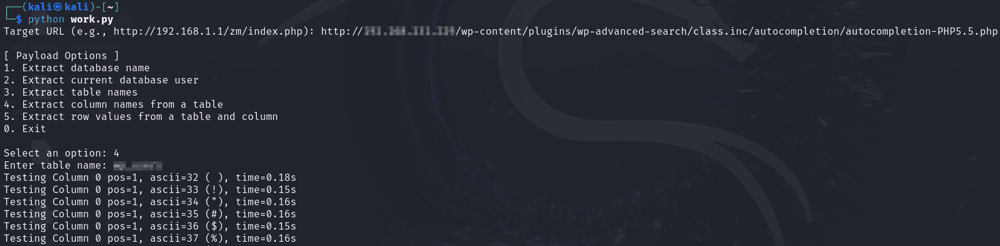

# PG_Workaholic

**Time-Based Blind SQLi**

---

### Scripts

- **`work.py`** – No threading  
  → Slower, more accurate
- **`work2.py`** – Threading enabled  
  → Faster, but may return NULLs or incorrect characters

---

### Usage

```bash
python work.py
# OR
python work2.py
```

---

### Proof of Concept

#### Database Name
  


#### Current User
  


#### Table Names
  


#### Columns in a Table
  


#### Row Values from Table & Column (Grabbing Users & Hashes)
  
  
  

